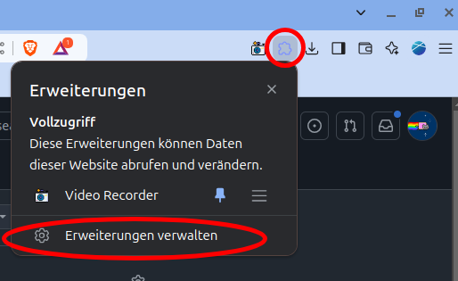

# extension_recorder

## Adding the extension in the browser
1. Goto your extensions page and "Erweiterungen Verwalten"  
  
2. Activate the development mode  
  
3. Click on the newly appeared "Entpackte Erweiterung laden"  
  
4. Select the repository folder and click add.  
5. Done. The Extension should appear here, as shown.  
  